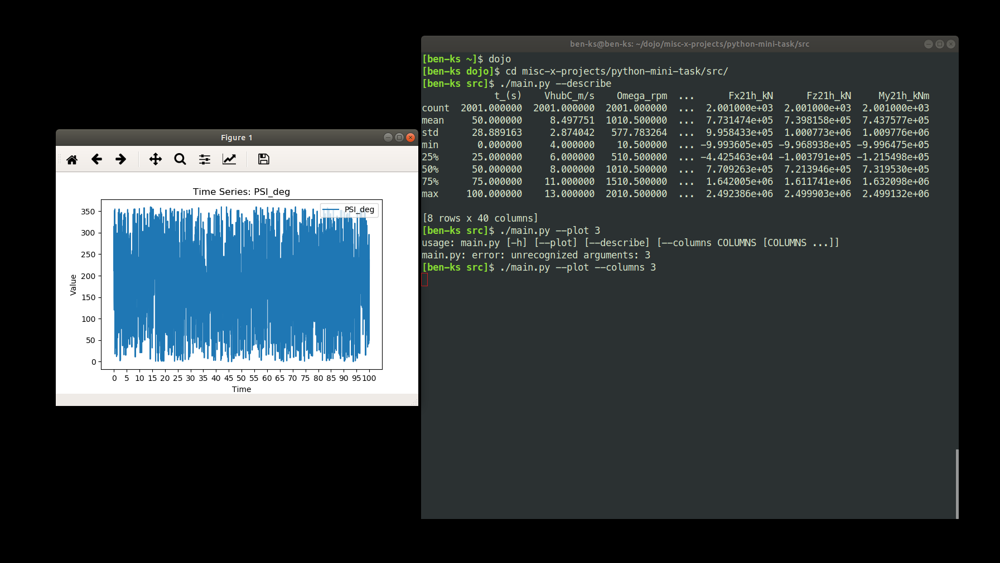

Live blog post:  https://eigenayoub.github.io/blogs/python-mini-task

### *State of the project so far:*

* Preprocessing is done.
* A simple CLI is done. 
* Image below, sums up what we can do so far:

### Progress:

[Done]:

* Read in the provided input.csv file, it includes time series for different sensors of a wind turbine.

* Reformat the data so that the first row includes the sensor name (from line 7) and the unit (from line 8) in the format <sensorname>_[<unit>] (excluding < and >), remove the rest of the header.

* Create a figure with 3 subplots showing one timeseries per subplot, with title, legend and axis titles. Save that figure as *.eps,

* Save your reformatted data as output.csv, separated with ;

[In Progress]:

* Create functions that can be launched from other modules. 
    * [DONE]  Basic utils file, with simple functions.
    * [TODO]  Write more useful functions (better plotting? some modeling?)

* Create a main-function to start your program,
    * [DONE]  Basic main file, with simple calls to utils files.
    * [DONE]  Basic CLI (command line interface) around.
    * [TODO]  Better documentation /  better interface.

*General guidelines:*

* Provide your code with documentation within the code,
* Use python, preferrably with standard libraries for your task, in addition to that, you can use every open-source software that you like, e.g. IDEs,
* Use PEP8 as coding-style,
* You may use object-oriented programming for your task, if you like.

### References:
* Tutorial on argparse: [https://realpython.com/command-line-interfaces-python-argparse/](https://realpython.com/command-line-interfaces-python-argparse/).
* ChapGPT: [https://chat.openai.com/](https://chat.openai.com/).
* Few Kaggle notebooks on Time series, for inspiration.
